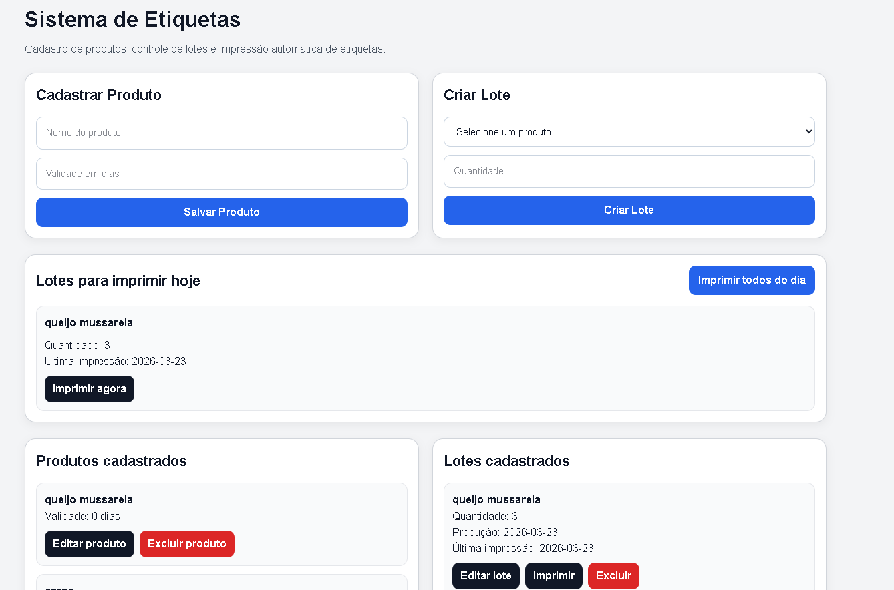

# ImpressaoDeEtiquetas

Sistema web para cadastro de produtos, controle de lotes e impressão de etiquetas em PDF.

## Funcionalidades
- Cadastro de produtos
- Edição e exclusão de produtos
- Criação, edição e exclusão de lotes
- Impressão manual de etiquetas
- Impressão automática de lotes do dia
- Geração de PDF

## Tecnologias
- Next.js
- React
- SQLite
- jsPDF

## Preview

